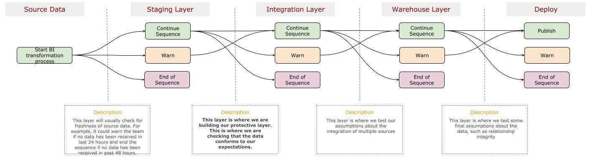
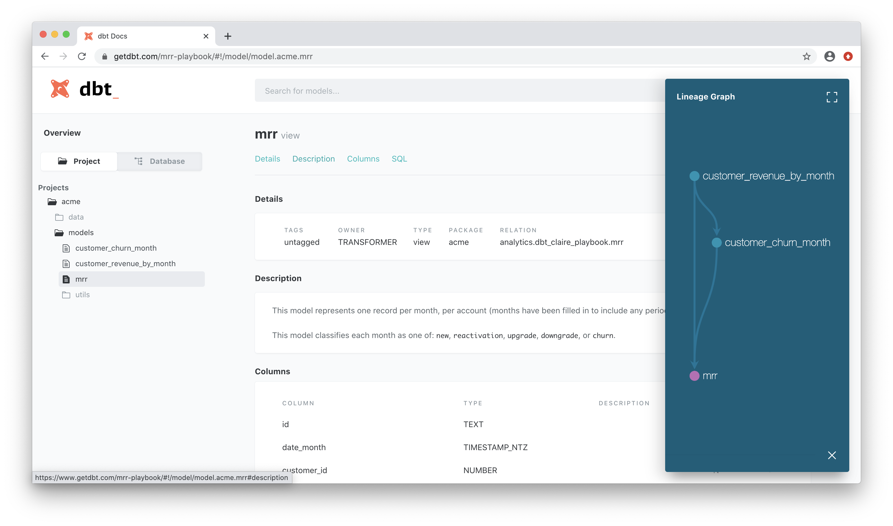

# Transformation and Testing Sequence and Strategy

This document provides information on the Rittman Analytics framework and how we approach both transformations of data and testing.


## Transformation Sequence

To provide context, let’s review the BI transformation process and the main layers that are composing it. Below is a graphical representation of how data is being progressively transformed into the public warehouse/BI layer.



There are essentially 4 types of models in that graph:

1. **Sources**: Those are pointers to the raw data we are consuming.

2. **Staging models**: This is the first layer of transformation, where we do basic cleaning (renaming, casting to data type, deduplication, filtering, etc.) operations on the source data. This is where our core assumptions about the shape of the data are.

3. **Integration models**: This layer integrates multiple sources of data to come up with single entities and where we enrich the entities with calculated fields. For example, we might have user information coming in from a website and a CRM. We would integrate those sources together to come up with a single complete view of that entity (users), plus calculate a `last_month_total_visits` field.

4. **Warehousing models**: This layer creates the public entities (such as `users`, `sessions`, `transactions`, etc.) as well as `xa` models (where we combine entities to extend our aggregates, such as when we apply an attribution model to session data) on top of that are to be consumed in a BI tool or by analysts.


## Test Coverage

The tests we are putting in place automates a decision process that is enabled at each stage of the BI transformation. Throughout that flow of data, we run different sets of tests that will take 1 of 3 decisions:

- Everything is conforming to expectations, we can proceed to the next stage of transformation
- There are non-major issues in the data that should be looked into, but we can proceed to the next stage of transformation
- There are major issues with the data, we are not to proceed to the next stage of transformation.

That sequence of transformation and testing is automated in a continuous integration and delivery system (for example dbt Cloud).


### Schema Tests and The Protective Layer

The protective layer  is where we validate that the data conforms to our assumptions. An example of that is that we could check that a timestamp field:

- Actually exists and is named `created_ts`
- Is a `datetime` type
- Is never `null`
- Its value is never beyond the current date

In dbt, we can test for all of those assumptions in what is called schema tests. Those tests reside in a yml file and have the following shape:

```
version: 2

models:
- name: stg_hubspot_users
    description: Hubspot table of users
    columns:
      - name: hubspot_user_id
        description: >
          Unique identifier for Hubspot users
        tests:
          - unique
          - not_null
```

As seen here, there are also descriptions of the data in that file, as it is also used to generate the documentation about your transformation project. Below is an example of documentation auto-generated by dbt.



In the above `yml` file, we can see 2 types of schema tests:

- **unique** - The most common test, which validates that the value for this field is unique throughout the whole table.
- **not_null** - Another very common test, which validates that a field’s values are never null.

Here are other types of schema tests we’ve integrated:

- **not_null_where** - Same as the `not_null` test, but we check for a condition first. For example, we might assume that a `selling timestamp` would never be null if another `selling status` field is true
- **not_constant** - This one is close to the `unique` test, but takes into account there might be duplicate values. But it validates that the field is not populated of only 1 value.
- **accepted_values** - Validates that a field can only be populated with a defined list of values. For example, the `user_status` might have only the following values: `visitor`, `trial`, `paying`, `dormant`, `churned`.
- **expression_is_true** - This is a less common test, but very useful as we can validate that the relationship between 2 fields matches some assumptions.
- **relationships** - Checks that a field’s value is present within another table’s field. For example, we might want to validate that `user_id` values in the `transactions` table can actually be found in the `users` table.


### Auditing and Data Tests

Once the warehouse layer has been built, we proceed to doing an audit of measures against current KPI reports. That process isn't an ongoing activity, but serves as a sanity check for initial developments. A good practice is to version control the validation SQLs in dbt's `analysis` directory. 

Another sanity check we do is to create data tests that continuously assess KPI performance against a set of parameters. For example, we could create a data test that evaluates the performance of a `number of sessions` KPI on each transformation run. Using a custom macro we've created, the data test would be configured with the following parameters:

```
{{ 
    metric_performance(
        source_table = 'website_landing_pages', 
        metric = 'sessions',
        base_month_offset = 0,
        comparison_months_window = 2,
        performance_variation = 0.5
    )
}}
```

Finally, we can continuously assess that transformations haven't impacted our KPIs by keeping a trace of historical values and checking that when calculating KPIs after a new transformation run, the new values still matches what had been recorded previously. [This technique is documented here](https://discourse.getdbt.com/t/build-snapshot-based-tests-to-detect-regressions-in-historic-data/1478).


## Dealing with Data Issues

As we are deploying the dbt project to production, the associated suite of tests will start triggering warnings and errors that should be dealt with. In that regards, we need to define what's the escalation process.

### Levels of Severity

As we've covered in the previous section, each layer in the transformation process has a suite of tests that will tell the transformation to continue, generate a warning and continue, or generate an error and stop. How we determine whether the process generates a warning or an error depends on our own configurations.

In dbt, each test can can be configured with [either of those 2 levels of severity](https://docs.getdbt.com/reference/resource-properties/tests/#severity):

- **Warnings** - “If warn is supplied, then dbt will log a warning for any failing tests, but the test will still be considered passing.”
- **Errors** - As for errors, dbt will log the error and consider the test to fail.


### dbt Cloud Setup

The sequence we described above is important, because we want to keep the `public` layer free of errors. That means that if an error is triggered between the `source` and `staging` layers (or between any other layers), then the transformation will stop. It will be the responsibility of the team to deal with that issue before the transformation process can be restarted.

Note that if this transformation process will keep the `public` layer free of errors, but if the transformation process does not execute completely, **the data in that `public` layer will not be refreshed**.


### Escalation Process

In dbt Cloud, we can set up notifications for the following 3 events:

- When a job succeeds
- When a job fails
- When a job is cancelled

And those notifications can either be sent:

- To an email
- To a Slack channel

So in our sequence of steps above, a job that goes through that transformation process would run each command in sequence and will send notifications to the proper channel whenever a warning or an error is generated by our test steps.

Of course, a job could also fail if a bug is introduced in the transformation steps themselves. That is out of the scope of this document, but it might indicate either:

- That a new PR has been merged with the dbt project `master` branch, but that it contained an error. You should roll back to the `master`'s previous version and refactor your PR.
- That a malformed data has slipped in and our schema tests haven’t picked it up. In that case, you should continue with the escalation process defined here and add a schema test for it in the dbt project.

Once a notification has been sent during the transformation and testing process, a sequence of actions should be triggered. Of course, the level of severity (`warning` or `error`) should define the expected time to respond to those issues. This is to be defined in internal SLAs.

Once an issue has been validated, a description and reproducibility steps (which includes the sql statements you ran above) should be entered into a Jira ticket. The severity level of the ticket should match the severity level of the dbt severity level.

To whom a ticket should be assigned, when and the actions to be taken are to be defined below or in a standalone SLA.
